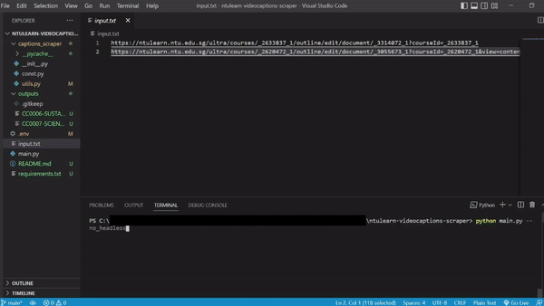

# NTULearn Video Captions Scraper

Uses Selenium to automatically scrape caption transcripts from [NTULearn](https://ntulearn.ntu.edu.sg/) videos and save them into text files. Only works for videos with subtitles enabled on the new Blackboard Ultra platform.

## Requirements 
- Required dependencies: `pip install -r requirements.txt`
- Chrome or Firefox installed on system

## Usage
- Edit `.env` file with your NTULearn login details 
```
  NTU_USERNAME=abc123@student
  NTU_password=password123
```

- Paste the NTULearn links containing the videos to scrape captions into `input.txt` file, with each link separated by a new line
- Run script on terminal: eg. `python scraper.py --no_headless`
```
usage: scraper.py [-h] [--firefox] [--no_headless]

Scrape captions of NTULearn videos

optional arguments:
  -h, --help     show this help message and exit
  --firefox      Use Firefox instead of Chrome
  --no_headless  Show UI, do not use web browser in headless mode
```
- Output text files will be saved in `outputs` directory



